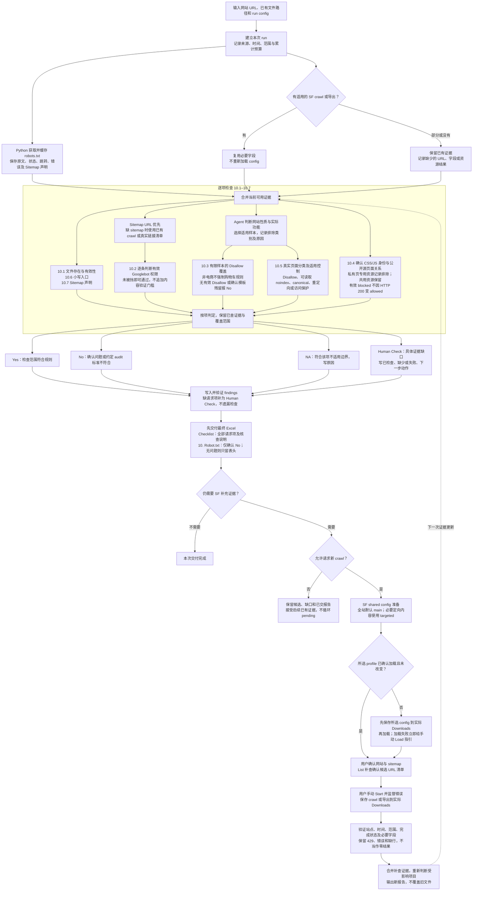

# Onsite Robots.txt Checking

<p align="center"></p>

独立的 `onsite-audit-robots` skill，用于检查 10.1–10.7，并生成 Excel。输入网站 URL、已有 Screaming Frog crawl／导出及 run config。

## 与 HTTPS flow 共用配置

沿用 HTTPS flow 的连接与运行配置结构，但本仓库模板只包含 robots 适用的字段。共用 `site`、`source`、`mcp`、预算和输出设置；各 flow 分别保留自己的检查设置及 requirements.txt。完整字段分工见 [config.md](references/config.md)。

- 同一 agent 可传入同一份 resolved config，复用 SF crawl、MCP 连接和 AUDIT_PYTHON。
- robots 模板已移除 HTTP/mixed-content/hostname 检查开关和 preferred_origin；整合配置仍可携带这些字段，但由 HTTPS flow 使用。
- 原始证据与 usage.json 可共用；请求/MCP 预算累计，不能每个 flow 重新归零。访问同一 SF 实例须串行。
- `source.allow_new_crawl` 默认 false。发现候选 URL 不自动授权新 crawl；可先生成 URL 清单，复用已有证据或等待 SF 导出。
- robots 补充发现的临时清单上限 1,000 页、深度 5、候选上限 100，不保证全部覆盖；collector／agent 直接请求每秒 1 次并受共用直接请求预算约束。SF 请求使用其实际 profile 的速度／范围设置，不能把 200 个直接请求预算或这里的速率写成主 crawl 上限。
- 不写死用户名、盘符、SF 端口或运行机路径。沿用已有 MCP/runtime 配置，无需建立第二个 server。
- collector 固定复用同一 run/origin 的证据；新采集需要新 run。模板不提供未实现的 force_refresh、TTL、自动重试或连续错误停止开关。
- 空 robots.txt 必须报问题是固定 audit 规则，不再提供 empty_file_is_issue 开关。

## 分工与检查

| 组件 | 负责内容 |
| --- | --- |
| Python | 获取并缓存 robots.txt、提取 sitemap 声明、准备候选 URL、整理证据及生成 Excel |
| Screaming Frog | 实际抓取响应、Googlebot robots 权限、Meta Robots、X-Robots-Tag、canonical、CSS/JS 及渲染证据 |
| Agent | 根据页面内容分类，按预设策略判断，编写 Findings、问题描述与修复方法 |

## 10.1–10.7 逐项检查逻辑

此 skill 只执行 robots 检查，不执行 9.1–9.3 的 HTTP→HTTPS、Mixed Content 或 www/non-www 检查。响应及跳转证据用于判断 robots 文件、资源可用性或候选页面类别；SF 配置、crawl 和运行环境可以共用。

| Item | 怎么检查 | 结果判断 |
| --- | --- | --- |
| **10.1 robots.txt 是否存在？** | 请求小写 `/robots.txt`，保存状态、跳转和原文，检查有效指令、空文件及错误 HTML。 | **Yes**：有效文件。**No**：确认不存在、内容无效、空白或仅注释。**Human Check**：403、429、超时或截断等使结果无法确认。 |
| **10.2 重要页面有没有被误挡？** | 提取 sitemap URL，逐条判断有效 Googlebot 规则。没有可用 sitemap 时，用已有 crawl／真实链接建立替代清单；不额外要求页面分类、noindex 或内容验证。 | **Yes**：检查范围中的 URL 全部未被挡。**No**：确认有 URL 被挡，列地址及匹配规则。**NA**：robots.txt 确认不存在，或用户明确不用检查。**Human Check**：清单／权限证据不完整，写明已查和未查范围。 |
| **10.3 有没有合适的 Disallow？** | Agent 先根据实际内容、导航、功能和用户信息判断网站性质，选择适用的有限样本，再检查有效 Googlebot 规则。购物车、结账、账户等是可选类别，不是所有网站的必选项目。 | **Yes**：选定的适用样本全部被挡，且没有确认模板残留等其他问题，注明样本范围。**No**：确认有不适用／未清理的模板规则；可读 robots 完全没有适用于 Googlebot 的非空 Disallow；或确认应限制的真实 URL 未被挡。确认模板残留写入 `10. Robot.txt`，列依据及清理方法；无 Disallow 写 further validate 建议。**Human Check**：规则不明确，或未挡候选的存在性／适用性未确认。**NA**：确认缺文件、明确不检查，或有依据证明检查不适用；无有效 Disallow 的 No 约定优先。 |
| **10.4 CSS／JS 是否允许抓取？** | 从 SF 类型／Content Type／真实 stylesheet或script引用确认 CSS／JS，关联需要索引的公开页面，检查有效 Googlebot 权限及响应。HTML login/reset 页面本身不当作 CSS／JS；仅供已确认私有／不需索引页使用的资源记录排除，共用的公开页资源仍检查。 | **Yes**：适用公开页资源确认允许抓取且可用。**No**：必要公开页资源有效被挡或失效；HTTP 200 不会把 robots blocked 变成 allowed。**Human Check**：SF 抓取／导出错误，或缺少资源、关系、权限结果。**NA**：完整清单证明没有适用的链接 CSS／JS。 |
| **10.5 特殊页面是否正确处理？** | 优先用真实 URL，按实际功能补充有限候选；确认页面类别后，检查对应策略，见下表。 | **Yes**：适用类别全部符合策略。**No**：确认存在不符合策略的页面。**NA**：类别确实不适用，写依据和范围。**Human Check**：用途或实际控制无法确认。 |
| **10.6 是否使用小写 robots.txt？** | 验证小写 `/robots.txt` 是否返回有效文件；小写正常时不强制再试大写，也不猜服务器文件名。 | **Yes**：小写入口有效。**No**：小写内容无效，或确认只有错误大小写入口有效。**NA**：确认文件不存在，引用 10.1。**Human Check**：请求失败，无法判断。 |
| **10.7 有没有 Sitemap 声明？** | 在完整 robots 原文中检查至少一个有效的绝对 HTTP／HTTPS `Sitemap:` URL。 | **Yes**：有有效声明。**No**：已读取文件没有有效声明。**NA**：robots 文件确认不存在。**Human Check**：原文无法完整取得。Sitemap 下载 429 单独记录，不把有效声明变成 No。 |

### 10.3 按网站性质选择样本

- 有真实购物功能才选择适用购物车／结账样本；企业展示站、内容站、会员站按实际功能选择搜索、筛选、账户或其他有依据的低价值路径。
- 非电商／无站内购物功能的网站，缺购物车或结账 Disallow 不算失败，也不建议补这些规则。普通分类页和正常分页不被统一要求 Disallow。
- **确认有不适用的购物／其他模板残留规则：10.3 判 No／X，并写入 `10. Robot.txt`。** 列明实际规则、网站不适用的依据及针对性的清理动作；不要求先证明误挡或安全问题。只是疑似、用途未确认时，写 Human Check，仅留 Checklist。即使其他适用样本全部被挡，确认模板残留仍优先判 No。
- 完全没有有效 Disallow 仍按约定判 No；进一步验证建议必须针对实际网站功能，不推断安全泄露，也不建议添加无关规则。
- Findings／Coverage 写清网站性质的判断依据、选定及排除类别和原因。collector 的通用候选清单只提供线索；先筛选再补查，不无限枚举。

### 10.5 特殊页面策略

默认策略如下，明确的网站策略优先。不统一要求所有类别 Disallow。

| 类别 | 接受的处理方式 |
| --- | --- |
| 购物车 | 有效 Disallow，或 Googlebot 能读取的 noindex |
| 普通感谢页 | Disallow 或可读取 noindex；私人订单内容还需要访问保护 |
| 后台 | 受保护内容／功能需要认证或授权；Disallow 不能代替保护 |
| 账户页 | 私人内容需要授权；公开登录／注册页默认检查 Disallow 或可读取 noindex |
| 重复内容 | 合适的 canonical、重定向或可读取 noindex；明确不必要的抓取变体可采用 Disallow |

10.3 检查适用样本的规则覆盖，10.5 检查真实页面及实际控制。默认插件规则、路径名称及 HTTP 200 不能单独证明功能存在。未发现候选不能证明页面不存在。SF 的 Non-Indexable 不等于 noindex；忽略 robots 后读到 noindex，不代表 Google 能读取。不登录私人账户、不提交订单；因此无法验证的流程写 Human Check。

### 10.4 登录／重置页面与资源的区别

| SF 证据 | 处理方式 |
| --- | --- |
| 被挡的是 HTML 登录／重置页面本身 | 不计为 CSS／JS 缺陷；转 10.5 判断用途及策略。login/reset 不一定是管理员页，也不因被挡就认定坏掉。 |
| CSS／JS 确认仅供有意排除的登录／后台页面使用 | 从 10.4 排除，记录地址、关系及原因；不称其为 allowed。 |
| 同一个 CSS／JS 也被首页／产品／文章等公开页需要 | 保留在 10.4；有效被 robots 阻挡则 No，列资源和受影响公开页。 |
| 资源通过人类请求／ignore-robots 返回 200，但有效规则仍阻挡 Googlebot | 仍是 blocked，不能写 allowed。检查有效 Allow 例外时按匹配规则处理。 |
| SF 只显示 robots blocked，未实际请求到服务器 | 不把未请求状态当 404／5xx；页面是否坏掉需要实际响应、跳转及内容证据。 |
| 缺类型、源页面关系或权限结果 | Checklist 写 Human Check，保留已查范围；不能猜是资源／管理员页或通过。 |

## 完整工作流程

先复用当前证据并逐项判断，交付包含全部请求项的 Excel，再安排需要用户操作的 SF 补查。配置失败、缺 sitemap 或某项缺字段，不让其他已有充分证据的项目停在 pending。图中的后续回路代表用户补充证据后的新版报告，不是自动重爬或无期限等待。



流程图源文件：[robots-audit-workflow.mmd](assets/robots-audit-workflow.mmd)。

### 默认／插件规则的边界

robots.txt 中的 add-to-cart、woocommerce 上传目录或日志路径，只作为候选线索，不证明网站有购物车、插件仍启用或敏感文件公开。区分“有规则”“测试 URL 被规则阻挡”“实际页面存在”。只有内容及真实流程证据支持后，才套用对应类别策略。完成有范围的发现且没有真实购物流程线索，或站点负责人确认不适用时，购物车子项 NA 并写明原因；已知流程、未测试候选或错误挡住验证时为 Human Check；其他类别仍独立判断。确认已不适用的模板规则即产生 10.3 No 和问题行；只有规则外观而无法确认用途时，用 Human Check 留在 Checklist。admin-ajax 的 Allow 也不单独视为后台泄露。详细规则见 [robots-rules.md](references/robots-rules.md)。

### 分页／分类变体

候选增加 /page/2、?page=2、?paged=2、/category、/categories，并从真实链接补充分类 slug 及筛选/排序变体。默认每条分页链最多取 10 页，每类分类最多抽样 5 个变体，由 Agent/SF discovery 流程执行，同时受全局预算约束。去除 fragment 后去重，不无限生成页码或参数组合；检测循环、重复内容与无效分页，记录被排除范围。正常分类页和内容不同的分页不自动 Disallow/noindex，也不统一 canonical 到第一页。collector 只生成有限清单，不负责控制 SF 整站 crawl。

## Excel schema

| Sheet | Columns |
| --- | --- |
| Checklist | Check · Result · Findings · Coverage |
| 10. Robot.txt | Issue · Issue Description · How to Fix · Address |

Result 使用 **Yes / No / NA / Human Check**。证据不足也照样输出最终 Excel，不等补查完成、不留空、不把缺证据填成 NA 或已确认 No。每个 Human Check 在 Findings 写“已检查什么＋支持的结果／数量”“缺少／失败什么”“下一步动作”，Human Check 只保留在 Checklist，不写入 `10. Robot.txt`。No 只代表确认问题，必须有关联 defect issue；若同时有缺口，保留 No 并在 Findings 追加 Human Check，不另列核查 Issue。NA 必须有原因。全部请求项目都包含在最终文件，不能只交 progress.json 或以省略项目掩盖未完成范围。evidence_gaps.json／handover 继续保留用于后续更新，报告交付不等于整体 audit 通过。两张表及既有列保持不变；Human Check 黄色标记。完整输入定义见 [report-schema.md](references/report-schema.md)。缺行或缺核查原因／动作时，通过 `--site-url` 明确启用交付补齐，补为 Human Check；`--prepared-input` 保存实际交付输入。无关字段或未确认历史 config 不阻止有独立证据的判断。

Findings 使用 Excel 单元格内的**局部加粗**，提高扫描可读性：已检查、结论、缺口／错误、下一步动作等标签自动加粗；Agent 通过内部 `findings_bold` 指定关键结论、数量、阻挡原因或排除依据。没有标签的短开头结论也会加粗。正文、完整 URL、换行和原有列保留，不把整段文字统一加粗，也不在 Excel 显示 Markdown 星号。详见 [Findings 加粗输入](references/report-schema.md#findings-emphasis)。

文件名：`{site name}_robots_audit_{YYYY-MM-DD}.xlsx`，日期按用户时区；已有文件不覆盖。

Human Check 示例仅说明写法，不是实际网站结果：

> **已检查：**读取 robots.txt，整理 80 条 sitemap URL，确认其中 75 条未被挡。
>
> **缺少／失败：**另外 5 条权限结果因 SF 导出错误未取得。
>
> **下一步：**补充这 5 条结果，或验证对应 Googlebot 规则。
>
> **Coverage：**75／80 已验证，5 条未确认。

Human Check 不进入 `10. Robot.txt`。No 同时有缺口时，问题页保留确认问题，未验证范围只写在 Checklist。没有确认问题时，问题页只保留四列表头。旧输入中的 human_check issue 会迁移到对应 Checklist Findings，保留描述、动作和地址。


## 使用

### SF 共享配置前提

配置加载统一由独立 [sf-shared-config](https://github.com/timn-firstpage/On-_site_SF_shared_config) 负责，需单独安装；此 robots 仓库不复制配置文件，也不自动安装共享 skill。详细路由及每项证据见 [共享前提与 caller 验证](references/sf-first-run-setup.md)。

| 当前情况 | 执行方式 |
| --- | --- |
| 已有适用 crawl／导出 | 核对站点、时间、范围、完成状态和必要字段后直接复用；不用 load config，不要求全部历史设置可见 |
| 部分证据可用 | 保留支持的判断，只补缺少的 export／特定 URL／内容证据，不强制重爬全站 |
| 正在爬取 | 不覆盖配置、不打断；先交包含 Human Check 的最终 Excel 和 checkpoint，你完成并交文件后更新 |
| 没有适用证据、允许补爬 | shared skill 默认选择 main；必要定向补查用 targeted profile。你确认网站和 sitemap，手动 Start、监督并保存到实际 Downloads |
| native／独立 config load 失败 | 立即提供手动 UI Load + sitemap 指引，保留原错误；不 retry native、不循环 pending、不用 sf_crawl(config_path) 偷启动 |
| shared skill 未安装 | 提供安装链接或对应手动流程；不假称已调用，也不阻止复用适用文件 |

`source.allow_new_crawl` 只允许请求新的 discovery／List 补爬，不能授权 agent 自动启动；false 时保留候选和证据缺口。已确认配置加载且未改变就跳过 load，HTTPS 和 robots 共用同一会话准备记录。你加入网站 sitemap 后不重新加载通用 profile。List 补查用候选清单，不要求重复全站 sitemap 流程。

Main 默认 JS、关闭全站 HTML 存储；targeted profile 保存必要补查的 source/rendered HTML。已有静态证据无需因此重爬。robots 的小范围发现上限不修改 shared main，配置文件不保证 connector 能导出所需内容。

手动 Load 前，Agent 先把选定 `.seospiderconfig` 保存到 SF 电脑的实际 Downloads 并验证，再给完整路径让你加载和检查 sitemap。同名不同内容不覆盖；跨电脑或权限导致无法保存时，先给下载／复制步骤并说明未完成保存。配置文件与之后保存的 `.seospider` 结果分别交接。

保存后仍需验证文件与数据：`.seospider` 要由 SF 成功 load 并检查字段／导出；CSV 要有可读结构、完整行和必要字段。sf-handover.json 只记录准备与用户确认，不是 audit 通过证明。记录网站 429 与 MCP 429 的来源、Retry-After、受影响范围；错误或缺行不能当零结果。

不要求补齐所有 Googlebot／robots／rendering config。有效响应、header、meta robots、canonical 和可独立解释的 live robots 规则支持对应判断；只有结论依赖 SF 抓取行为且缺等效证据才核实相关设置。10.1／10.6／10.7 可以从直接 robots 证据继续，配置失败不代表这些项失败。其他缺口必须写明具体 URL／字段／结论和补充动作，不能只写“native app control failed”。缺少有效 sitemap 要说明发现范围，但不阻止其他有证据的检查。

你手动运行并监督；持续 429、连接错误或 URL 循环时由你决定暂停／调整／继续／重跑。正常 404 或重定向保留作 audit 证据，不自动重启。完成后确认必要 Crawl Analysis 已结束，保存／导出到你实际的 Downloads 并提供路径和完成状态；自动数据库保存不等于文件已放到 Downloads。等待文件时返回可恢复 checkpoint，最终 Excel 包含全部请求项；未解决项显示 Human Check 和人工核查动作，照样交付。

将仓库作为 skill 导入，入口是根目录 [SKILL.md](SKILL.md)。默认可自动发现，也可显式调用 `$onsite-audit-robots`。导入 skill 不等于安装 Python 或连接 MCP。安装位置由你的客户端确定；仓库不自动改全局客户端设置。

当前两个 flow 的第三方运行依赖均为 `openpyxl>=3.1,<4`，robots 下载使用 Python 标准库 urllib；因此可共用已验证的 Python 3.9+／venv。各仓库仍独立维护 requirements.txt，未来整合环境安装兼容的依赖并集；版本冲突时使用独立 venv，不直接覆盖既有环境。PyYAML 仅用于 skill 作者校验，不是 audit 运行依赖。

使用已有 AUDIT_PYTHON；没有环境时，在当前执行机创建 venv 并安装 requirements.txt。Windows 使用 `.venv/Scripts/python.exe`，Mac/Linux 使用 `.venv/bin/python`。不要复制其他电脑的 venv。

```bash
python3 -m venv .venv
.venv/bin/python -m pip install -r requirements.txt
.venv/bin/python scripts/test_report.py
.venv/bin/python scripts/test_collect.py
```

复制 config.template.json 到唯一 run 目录并填写实际网站、crawl/export 来源、MCP 与日期。示例（路径需换成实际 run）：

```bash
.venv/bin/python scripts/collect_robots.py --config runs/example/config.json --run-dir runs/example
.venv/bin/python scripts/build_report.py --input runs/example/findings.json --output-dir runs/example --site-name Example --date 2026-10-05 --site-url https://example.com/ --prepared-input runs/example/findings-delivery.json
```

collect_robots.py 仅获取 robots 文件及生成候选，不自动验证候选或爬取 sitemap。SF 拉取、页面分类和 findings.json 由执行 agent 完成。需要字段/候选证据但当前工具无法取得时，保留未确认结论，不能补猜结果。

## 验证范围

离线测试使用合成证据，验证分类、候选生成、两张表字段、NA 原因、No／确认问题页关联、URL/query 保留、公式注入防护与禁止覆盖。未执行真实网站或 SF MCP 端到端测试，不能把样例当客户 audit。规则依据见 [robots-rules.md](references/robots-rules.md)，本机 MCP 事实以实际工具 schema 为准。

## 共用 crawl 的性能与任务隔离

先复用主 crawl 的 URL/状态/指令/canonical/资源关系，仅对无法判断的候选补充 HTML。robots 的 1,000 页、深度 5、分页 10 页/分类变体 5 个等限制，只用于 robots 补充发现，不写入其他任务的主 crawl/default profile。主 crawl 的范围及预算由整合 agent 决定，不能拿 robots 模板的 200 个补查请求数字作为全站 crawl URL 上限。共享 usage 仍累计，不暗中增加总体预算。

补查通过 shared skill 准备独立 List Mode profile/crawl ID，由你手动运行。默认每批 25 个必要 URL，按需要继续下一批而不是 25 个后停止；共享 targeted profile 存 source/rendered HTML，已有内容证据直接复用。预算不足记录缺口，其他不依赖此内容的任务继续。切换回主配置时沿用共享准备记录并保留实际 sitemap，不自动恢复通用 profile 覆盖你的网站设置。JSON 设置不会自动改变本机 SF。

## 判断边界与交付修正

每次先完成当前可执行的有限检查，交付最终 Excel，再安排手动补查；不因等待 SF、sitemap、业务答复或 HTML export 停留在 pending。具体边界见 [delivery-boundaries.md](references/delivery-boundaries.md)。

| 情况 | 判断方式 |
| --- | --- |
| 缺候选响应／内容、429、预算耗尽 | Human Check + 缺口 + 人工动作只写 Checklist，照样导出 |
| 已确认问题，但另有未验证范围 | 保留 No 和 defect issue，Human Check 只追加在 Checklist |
| 10.2 的 NA | 仅限 robots.txt 确认缺失或用户明确不检查；没有某类页面不把该项判 NA |
| 10.5 某类别真正不适用，或完成 scoped discovery 后无对象／真实流程线索 | NA + 原因 + 范围；不能把未测试当不存在 |
| CSS／JS | 同站及外部必要资源都检查；SF crawl/export error 或缺资源结果为 Human Check，并说明已查及未查范围 |
| 一个类别已有充分的合适控制 | 不强制收集所有替代控制；字段按具体判断需要获取 |
| 已知交易后感谢页／后台 403 | 不交易、不登录；无法确认控制时 Human Check，不猜不存在或已保护 |
| 其他 bot 被挡，但 Googlebot 的证据完整 | 默认 Google SEO 判断继续；只对用户指定的额外渠道套用要求 |
| 有有效 Sitemap 声明，但 sitemap 请求 429 | 10.7 声明检查仍可 Yes；另说明 sitemap 健康／发现覆盖缺口 |

交付补齐保留严格事实校验：不自动造 Yes／No／NA，不掩盖不正确的 check ID、缺 defect issue、非法输入或写文件失败。实际导出输入可留档，已交付文件不覆盖。collector 保存各响应的 Retry-After／Content-Type，遇 429 不自动重试；候选仍需验证。

10.3 的样本 Yes 是规则匹配结果，不证明枚举页实际存在；确认未清理的模板规则仍判 No 并列入问题页；10.5 仍独立检查真实功能和处理策略。没有 Disallow 的 No 是本次约定 audit 标准下的配置问题，不宣称已有泄露；修复建议先核实实际需要限制的 URL，再配置合适规则。一般分类页和正常分页不因样本检查被统一要求 Disallow。
